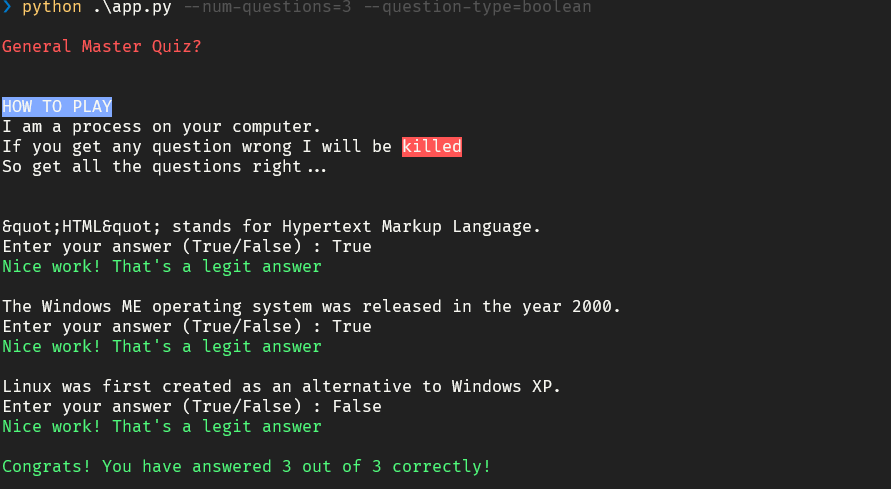

# Typer Quiz


A command-line quiz game that retrieves trivia questions from the Open Trivia Database API and challenges you to answer them correctly.

## Installation
Open command prompt and create new environment
```
conda create -n your_env_name python=(any_version_number > 3.10)
```
Then Activate the newly created environment
```
conda activate your_env_name
```
Clone the repository using `git`
```
git clone https://github.com/Prakashdeveloper03/Typer-quiz.git
```
Change to the cloned directory
```
cd <directory_name>
```
Then install all requirement packages for the app
```
pip install -r requirements.txt
```

## Usage

To start the quiz, run the following command:

```shell
python app.py [--num-questions <num>] [--category <id>] [--difficulty <level>] [--question-type <type>]
```

Available options:
```shell
--num-questions <num>: Number of questions to answer (default: 5).
--category <id>: Category ID of the questions (default: 18, which corresponds to 'Computer Science').
--difficulty <level>: Difficulty level of the questions (default: 'easy').
--question-type <type>: Type of the questions (default: 'multiple').
```

The quiz will present each question one by one and prompt you for an answer. For multiple-choice questions, enter the number corresponding to your choice. For boolean questions, enter 'True' or 'False'. If you answer any question incorrectly, the game ends.

## Screenshot
